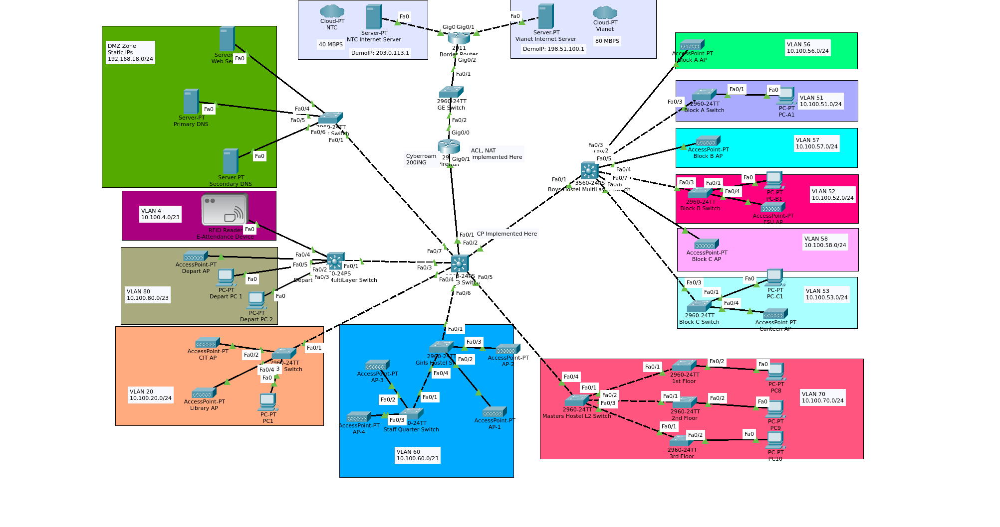

# PCampus Campus Network
Designed and implemented in Cisco Packet Tracer 


## Network Topology



---

## Project Overview

PCampus is a fully configured campus network serving multiple zones including Boys Hostel (Blocks A, B, C), Girls Hostel, Masters Hostel, Department, CIT/Library, and a DMZ server zone.

The network features dual ISP redundancy, centralized routing via OSPF, VLAN segmentation, NAT/PAT, ACL-based firewall security, and DHCP for all zones.


## Network Architecture
```
NTC / Vianet ISP
      |
   sachin1 (Border Router) 
      |
   GE Switch (L2)
      |
   sachin2 (Firewall) ← NAT/PAT + ACL 
      |
   CentralSwitch (L3 Core)
      |
  ┌───┼───┬───────┬──────────┐
  │   │   │       │          │
Boys Girls Masters Dept   CIT/Lib  DMZ
```


## Device Summary

| Device | Model | Role |
|--------|-------|------|
| sachin1 | Cisco 2911 | Border Router — Dual ISP, OSPF |
| GE Switch | Cisco 2960-24TT | L2 Switch between sachin1 and sachin2 |
| sachin2 | Cisco 2911 | Firewall — NAT, ACL, AAA |
| CentralSwitch | Cisco 3560-24PS | Core L3 Switch — VLANs, OSPF, DHCP |
| BoysHostelSwitch | Cisco 3560-24PS | L3 Aggregation — Boys Hostel |
| DeptSwitch | Cisco 3560-24PS | L3 Switch — Department & RFID |
| CITSwitch | Cisco 2960-24TT | L2 Switch — CIT & Library |
| MastersHostelSwitch | Cisco 2960-24TT | L2 Switch — Masters Hostel |
| GirlsHostelSwitch | Cisco 2960-24TT | L2 Switch — Girls Hostel |
| ServerSwitch | Cisco 2960-24TT | L2 Switch — DMZ Servers |
| BlockA/B/CSwitch | Cisco 2960-24TT | L2 Access — Boys Blocks |
| Floor1/2/3Switch | Cisco 2960-24TT | L2 Access — Masters Floors |


## IP Addressing

### WAN Links

| Interface | IP Address | Connected To |
|-----------|-----------|--------------|
| sachin1 Gig0/0 | 203.0.113.2/30 | NTC ISP (40 Mbps) |
| sachin1 Gig0/1 | 198.51.100.2/30 | Vianet ISP (80 Mbps) |
| sachin1 Gig0/2 | 10.10.10.1/30 | sachin2 Gig0/0 |
| sachin2 Gig0/0 | 10.10.10.2/30 | sachin1 Gig0/2 (NAT Outside) |
| sachin2 Gig0/1 | 10.10.20.1/30 | CentralSwitch Fa0/1 (NAT Inside) |
| CentralSwitch Fa0/1 | 10.10.20.2/30 | sachin2 Gig0/1 |
| CentralSwitch Fa0/7 | 192.168.18.1/24 | DMZ ServerSwitch |

### VLAN SVIs (CentralSwitch)

| VLAN | Name | Subnet | Gateway |
|------|------|--------|---------|
| 4 | RFID | 10.100.4.0/23 | 10.100.4.1 |
| 20 | CIT_Library | 10.100.20.0/24 | 10.100.20.1 |
| 51 | Boys_Block_A | 10.100.51.0/24 | 10.100.51.1 |
| 52 | Boys_Block_B | 10.100.52.0/24 | 10.100.52.1 |
| 53 | Boys_Block_C | 10.100.53.0/24 | 10.100.53.1 |
| 56 | Boys_AP_A | 10.100.56.0/24 | 10.100.56.1 |
| 57 | Boys_AP_B | 10.100.57.0/24 | 10.100.57.1 |
| 58 | Boys_AP_C | 10.100.58.0/24 | 10.100.58.1 |
| 60 | Girls_Hostel | 10.100.60.0/23 | 10.100.60.1 |
| 70 | Masters_Hostel | 10.100.70.0/24 | 10.100.70.1 |
| 80 | Department | 10.100.80.0/23 | 10.100.80.1 |

### DMZ Servers

| Server | IP | Gateway |
|--------|----|---------|
| Web Server | 192.168.18.2 | 192.168.18.1 |
| Primary DNS | 192.168.18.3 | 192.168.18.1 |
| Secondary DNS | 192.168.18.4 | 192.168.18.1 |


## Test Results

| Test | Command | Result |
|------|---------|--------|
| DHCP | `ipconfig` on PC | IP from correct VLAN subnet |
| Gateway ping | `ping <gateway>` | Reply ✅ |
| Inter-VLAN | `ping` across VLANs | Reply ✅ |
| DMZ Web Server | `ping 192.168.18.2` | Reply ✅ |
| DNS resolution | `nslookup pcampus.local` | Returns 192.168.18.2 ✅ |
| Web browsing | `http://www.pcampus.local` | Campus page loads ✅ |
| Internet (sachin1) | `ping 203.0.113.1` | Reply ✅ |
| Internet (sachin2) | `ping 203.0.113.1` | Reply ✅ |
| ACL block test | ping internal from outside | Timed out ✅ |


## Default Credentials

| Credential | Value |
|------------|-------|
| Enable Secret | `class` |
| Console Password | `cisco` |
| Telnet Password | `network` |

